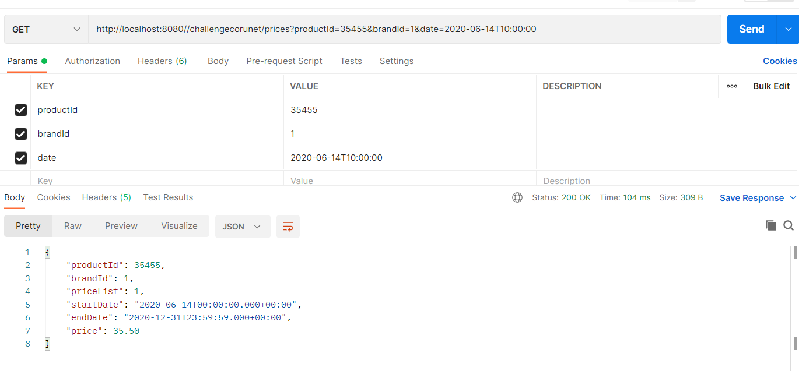

 CORUNET CHALLENGE
-------------------

-------------------

 - Ejemplo petición a API/REST - TEST 1

-------------------

URL-Api-back:

- GET: Price: http://localhost:8080//challengecorunet/prices?productId={}&brandId={}&date={}

